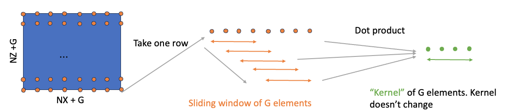
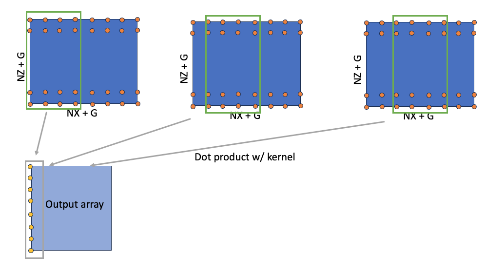
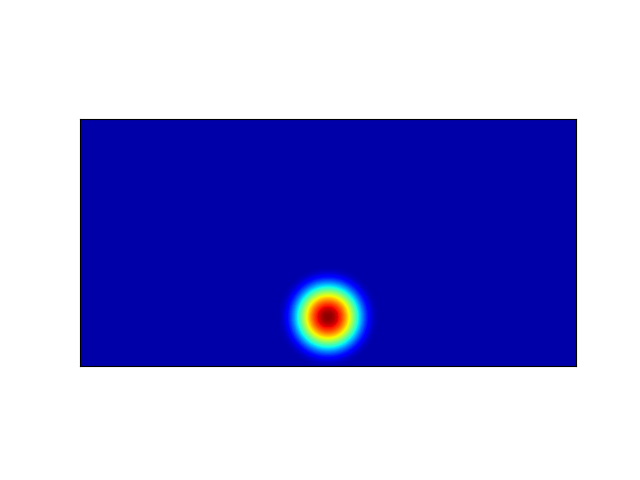
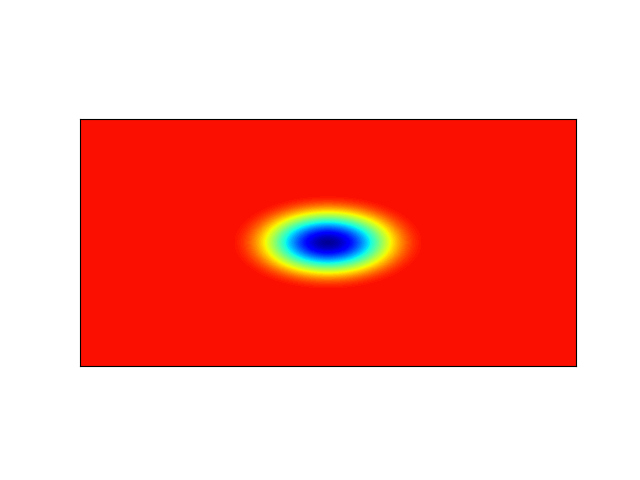
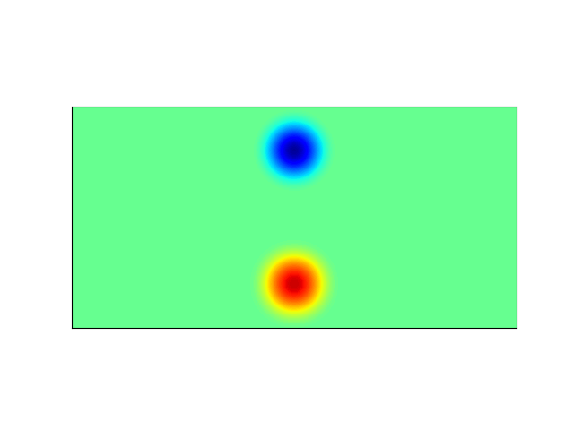

# PyMiniWeather

PyMiniWeather solves the compressible form of inviscid two-dimensional unsteady Euler equations using a finite volume discretization scheme. The discretized equations are second order accurate in space and third order accurate in time. See this [article](https://rmets.onlinelibrary.wiley.com/doi/10.1002/qj.3989) for more information on discretization. The current implementation is based on Matt Norman's [MiniWeather](https://github.com/mrnorman/miniWeather) that has serial and parallel implementations written in multiple compiled languages (C, C++, CUDA, OpenMP). However, this implementation focusses on an array-based implementation of the same algorithm.

This work is a pedagogical exercise meant to teach users how to approach problems in scientific computing using array-based paradigms instead of widely used element-wise codes using C, C++ or CUDA. Thus, this repository serves as a tutorial for users writing PDE solvers using NumPy. Array-based programming can be different from element-wise programming, and as will be demonstrated here, some of the computations like interpolation and numerical integration will be different from its element-wise counterpart.

We focus on the serial implementation of the [MiniWeather](https://github.com/mrnorman/miniWeather) app using two backends that support array-based programming: NumPy/SciPy and [cuNumeric](https://github.com/nv-legate/cunumeric). While NumPy only allows single threaded execution of the program, cuNumeric will allow execution on multiple GPUs/CPUs/OMPs with no code change to the serial code demonstrating significant improvement in developer productivity. This obviates the need for expertise in distributed computing for users interested in solving large problems in scientific computing.

## Learning Objectives
-  Learn the difference between the array-based implementation and element wise implementation of the solver
   - How to transform nested for loops into array-based codes
   - How to handle temporary variables found in element-wise codes
-  Learn how to develop a simple PDE solver using cuNumeric

### Pre-requisites
- The reader is expected to have a good understanding of the governing equations and the spatial and temporal discretization of the PDE. [Physics, PDEs, and Numerical Approximations](https://github.com/mrnorman/miniWeather?tab=readme-ov-file#physics-pdes-and-numerical-approximations) is a good starting point. Make sure you understand the reduced form of the discretized equations described in [Finite volume spatial discretization](https://github.com/mrnorman/miniWeather?tab=readme-ov-file#finite-volume-spatial-discretization) and the sub-steps needed for the third-order Runge-Kutta timestepping scheme described in [Runge-Kutta Time Integration](https://github.com/mrnorman/miniWeather?tab=readme-ov-file#runge-kutta-time-integration)

- Intermediate level familiarity with array-based programming, e.g., using NumPy in scientific computing is expected. More specifically, understanding of basic and advanced [indexing](https://numpy.org/doc/stable/user/basics.indexing.html), [reductions](https://numpy.org/doc/stable/reference/generated/numpy.sum.html), and array creation routines like [linspace](https://numpy.org/doc/stable/reference/generated/numpy.linspace.html) and [meshgrid](https://numpy.org/doc/stable/reference/generated/numpy.meshgrid.html#numpy-meshgrid) are needed.

- Know how to use classes in Python

- While not exactly a pre-requisite, a basic understanding of convolution operation will be helpful in understanding some parts of the code

- For multi-process or multi-threaded executions or to use GPUs, you will need to install cuNumeric. Follow installation instructions on our [page](https://github.com/nv-legate/cunumeric?tab=readme-ov-file#installation). Create an issue if you are having trouble installing. Use `NumPy` to get started.

## Key Concepts
- Learn how linear interpolation using custom weights can be implemented using NumPy
- Learn how numerical integration can be implemented using NumPy
- In general, learn how to transform nested for loops into their array-based equivalents in NumPy. While this topic can be vast, this repository teaches the above two concepts
- Be amazed when you realize that PyMiniWeather avoids all halo-exchanges that are commonly found in data-parallel codes implemented using MPI. For example, see the [halo exchange](https://github.com/mrnorman/miniWeather/blob/31e1f3803220b20e029b28bf62e7379749061db6/c/miniWeather_mpi.cpp#L399) in Matt's implementation. You won't see that or any other exchanges in this implementation. Take a minute and understand what that means. You just write serial code. That's it.

## Background

### Numerical Method

The 2D Euler equations are a simplified form of Navier-Stokes equations without the viscous terms. Since an hydorstatic balance is assumed, hydrostatic law for the variation of pressure in the vertical direction is used, and the equations reduce to the following form:

$$ 
\begin{align}
\dfrac{\partial }{\partial t} \left( \rho \right) &+ \dfrac{ \partial}{\partial x} \left( \rho u \right)  + \dfrac{\partial}{\partial z} \left( \rho w \right) = 0 \\
\dfrac{\partial }{\partial t} \left( \rho u \right) &+ \dfrac{ \partial}{\partial x} \left( \rho u^2 + p \right) + \dfrac{\partial }{\partial z} \left( \rho w u \right) = 0 \\
\dfrac{\partial}{\partial t} \left( \rho w \right) &+ \dfrac{ \partial }{\partial x} \left( \rho u w \right) + \dfrac{\partial}{\partial z} \left( \rho w^{2} + p \right) = -\rho g \\
\dfrac{\partial }{\partial t} \left( \rho \theta \right) &+ \dfrac{ \partial }{\partial x} \left( \rho u \theta \right)  + \dfrac{\partial}{\partial z} \left( \rho w \theta \right) = 0 \\
\end{align} 
$$

### Learning Array-based equivalents

PyMiniWeather currently supports periodic boundary conditions in x-direction and wall boundary conditions in z-direction and solves the governing equations for a rectangular domain that is twice as large in x- as in z- direction. A hyperviscosity term for stabilization is introduced by including a fourth derivative of the conservative variables in the governing equations.

The solution variables are stored at the cell centers and the fluxes and tendencies are stored at the cell edges. As is often the case with finite volume discretization, approximating the fluxes at the edges based on the quantities at cell centers involves reconstruction of the solution. In this implementation, a fourth-order accurate linear interpolation is employed for reconstruction of the solution variables and a first order accurate interpolation for the hyperviscosity term.

#### Learning how to implement linear interpolation with custom kernels

The linear interpolation with a fixed stencil described above is usually implemented using nested for loops like below (see [original code](https://github.com/mrnorman/miniWeather/blob/31e1f3803220b20e029b28bf62e7379749061db6/c/miniWeather_serial.cpp#L280)):

```
for (int k=0; k<nz; k++) {
  for (i=0; i<nx+1; i++) {
    for (ll=0; ll<NUM_VARS; ll++) {
      for (s=0; s < sten_size; s++) {
        inds = ll*(nz+2*hs)*(nx+2*hs) + (k+hs)*(nx+2*hs) + i+s;
        stencil[s] = state[inds];
      }   
      vals[ll] = -stencil[0]/12 + 7*stencil[1]/12 + 7*stencil[2]/12 - stencil[3]/12;
      d3_vals[ll] = -stencil[0] + 3*stencil[1] - 3*stencil[2] + stencil[3];
    }   
  }
}
```

The above implementation consists of looping over the spatial extents relevant to the output of the computation for all the four conservative variables (`NUM_VARS`). This helps select `window` of values from a conservative variable onto to the interpolating kernel or `stencil` as it is referred in the above code snippet. The window size in this example is controlled by the variable `sten_size`. The variables `vals` and `d3_vals `, which represent the fourth order and first order interpolation of conserved quantities and hyperviscosity term respectively, is obtained by a dot product of `weights` and the conserved variable. It is important to note that these two variables are temporary variables in the computation and that their values for each coordinate in the grid is independent of the rest. The operation is then repeated for all the variables and then the window is moved by one unit in the x-direction and eventually by one unit in the z-direction. See the figure below for a pictorial representation of the workflow.



Converting this code snippet to use NumPy or any other array-based library would require storing the temporary variables (`vals` and `d3_vals` in the above snippet) into an array. Additionally, computation for all grid points must be vectorized and then repeated for all the variables. Since `weights` is spatially independent, it is possible to extend the dimension of `weights` in the z-dimension and loop over just the x-direction. 



However, it is important to note that the moving window operation that is performed here for all points that are relevant for the computation of flux is conceptually equivalent to a convolution operation in NumPy. 

Convolution operations usually support three different modes of operation (full, valid and same) depending on the extent to which the interpolating kernel is allowed to convolve with the base array, which affects the size of the output. Since cuNumeric supports the "same" mode for convolution, we choose the "same" mode in this implementation. Since we convolve the conserved variables with an interpolating stencil to determine the flux at the cell edges, we can compute the shape of the flux array and slice the output array accordingly. See the code snippet below on how it is implemented:
```
fields.vals_x[...] = convolve(
    state[:, 2 : nz + 2, :],
    fields.fourth_order_kernel[np.newaxis, np.newaxis, :],
    mode="same",
)[:, :, 2:-1]

fields.d3_vals_x[...] = convolve(
    state[:, 2 : nz + 2, :],
    fields.first_order_kernel[np.newaxis, np.newaxis, :],
    mode="same",
)[:, :, 2:-1]
```
Note that for the NumPy backend, we use the `convolve` API from SciPy since NumPy does not support convolution of two-dimensional arrays. cuNumeric, on the other hand, does support convolution of two-dimensional arrays. Both the backends require the `kernel` to be of the same dimension as the array, so the one-dimensional kernel is extended to two-dimensions. Note that the shape of the two-dimensional `kernel` will be different for both x- and z- directions since there will be a non-unit stride in the z-direction. 

<!-- [THIS PARAGRAPH NEEDS A REWRITE]

Array programming patterns for simple element-wise operations that are trivial in C are different in array programming languages like Python. There are two such patterns in PyMiniWeather - a moving window operation using a fixed stencil to interpolate data and numerical integration using [Gaussian quadrature](https://faculty.washington.edu/finlayso/ebook/quadrature/methods/Gauss.htm), both of which can be implemented using nested for loops in element-wise implementations. In array programming languages, these two computational patterns transform to a convolution operation and a multi-axis unary reduction operation respectively. These two patterns make the array programming implementation far simpler since they obviate the need for manually loop through elements of . The key is to know that these patterns exist for widely used computational patterns. -->

We convolve the conservarive variables with the interpolating stencil/kernel to compute the interpolated quantity, which is the flux of the conserved variable. The `mode` option in convolution controls the size of the output. Make sure you understand that the flux is stored on the cell edges and that the dimension of the array would be `(nz + 1, nx + 1)`, while the conservative variables are stored on the cell centers that include the points in the interior and exterior and is of dimension `(nz + 4, nx + 4)` per conservative variable. The four points result from accounting for the two ghost points on either side of the domain. Knowing the dimensions of these arrays is imporant since the output of the array will depend on the `mode` of the convolution and the dimension of the inpur array. Refer to this [tutorial](https://towardsdatascience.com/the-most-intuitive-and-easiest-guide-for-convolutional-neural-network-3607be47480) to learn more about different convolution modes.

To compute the flux in `z`, we follow the exact same procedure as described above except that the shape of the kernel will change. Since we are interpolating in `z`, we have a non-unit stride in the computation, and the kernel should reflect that. This is done by changing the shape of the kernel such that the coefficients align with the `z` dimension of the array.

```
fields.vals_z[:] = convolve(
    state[:, :, 2 : nx + 2],
    fields.fourth_order_kernel[np.newaxis, :, np.newaxis],
    mode="same",
)[:, 2:-1, :]

fields.d3_vals_z[:] = convolve(
    state[:, :, 2 : nx + 2],
    fields.first_order_kernel[np.newaxis, :, np.newaxis],
    mode="same",
)[:, 2:-1, :]
```

#### Learning how to implement numerical integration using NumPy
PyMiniWeather supports evolution of the following flow configurations 

1. Rising thermal bubble (simulates hot bubble rising up)
2. Falling thermal bubble (simulates cold bubble falling down)
3. Colliding thermal bubbles (collision of hot and cold bubble)

The hot and cold thermal bubbles are created by making sure the background potential temperature is either smaller or larger than that of the potential temperature profile inside the bubble, which follows a squared cosine profile. The bubble is then evolved in time. A Gauss-Legendre quadrature is employed for the initialization of the hydrostatic states as described in section 3.4.1 in this [article](https://rmets.onlinelibrary.wiley.com/doi/full/10.1002/qj.3989). We focus on the array-based implementation of the quadrature computation. A simple element-wise implementation ([credits](https://github.com/mrnorman/miniWeather)) of numerical integration is given below, where a two dimensional matrix of quadrature points is created for each cell and reduced along the two dimensions before writing into the respective conservative variable (see [original code](https://github.com/mrnorman/miniWeather/blob/31e1f3803220b20e029b28bf62e7379749061db6/c/miniWeather_serial.cpp#L536)).
```
for (k=0; k<nz+2*hs; k++) {
  for (i=0; i<nx+2*hs; i++) {

    //Use Gauss-Legendre quadrature to initialize a hydrostatic balance + temperature perturbation
    for (kk=0; kk<nqpoints; kk++) {
      for (ii=0; ii<nqpoints; ii++) {
        // x and z of the quadrature points
        x = (i - hs + 0.5)*dx + (qpoints[ii] - 0.5)*dx;
        z = (k - hs + 0.5)*dz + (qpoints[kk] - 0.5)*dz;

        //Set the fluid state based on the user's specification
        collision (x, z, r, u, w, t, hr, ht);

        //Store into the fluid state array
        inds = ID_DENS*(nz+2*hs)*(nx+2*hs) + k*(nx+2*hs) + i;
        state[inds] = state[inds] + r * qweights[ii]*qweights[kk];

        // Do for other conservative variables
      }   
    }   

  }   
}
```

The numerical integration computation for a cell can be thought of as an elementwise dot product of two matrices with the matrices representing the GLL quadrature points inside the cell and the quadrature weights respectively. Note that the quadrature points are constructed by a linear transformation from the cell centroid and that these quadrature points are not required after this computation. In the above code snippet, these points are constructed on the fly and thus do not require any extra memory allocation. However, in the `NumPy` version of this computation, we can construct the GLL coordinates for the entire grid. Since there are 3 GLL points per dimension, and we simulate two-dimensional flows, we have 3x3 times the size of the regular mesh. This requires almost a 10X higher memory footprint to persist the mesh in memory.

[March 7, 7PM]

This translates to the following three operations in the array-based paradigm: create two new dimensions to the coordinate array and form the quadrature points, do element-wise matrix multiply with quadrature weights and the conservative variables computed at the quadrature points, and then reduce along the newly created axes to complete the numerical integration. This is shown in the code snippet below:

```
# Create Gauss-Legendre points for each cell
x, z = Mesh.get_mesh_int_ext()
x = x[:, :, np.newaxis, np.newaxis] + Quadrature.qpoints_grid_x * dx
z = z[:, :, np.newaxis, np.newaxis] + Quadrature.qpoints_grid_z * dz

# Create squared cosine profile of the bubble. 
r, u, w, t, hr, ht = collision(x, z, xlen)

# Update the conserved variables
fields.state[0, ...] = np.multiply(r, Quadrature.qweights_outer).sum(axis=-1).sum(axis=-1)

# Do for other conservative variables 
```

| Computation            | element-wise             | Array-based        |
| ---------------------- | ------------------------ | -------------------|
| Numerical integration  | Nested loops, reduction  | np.newaxis, np.sum |
| Linear interpolation   | Nested loops             | np.convolve        |


## Animations
Simulations of supported configurations mentioned above were performed for an extended period of time (several tens of thousands of timesteps). Check out the [script](tools/make_images.py) on how to create images that can be used to create animations. For users interested in changing the dimensions of the domain, make sure to also change the radius of the bubble in [initial_conditions.py](pyminiweather/ics/initial_conditions.py) that uses the function [sample_ellipse_cosine](pyminiweather/utils/utils.py). 

<!--
(Contour plots of potential temperature; red is high and blue is small)
-->

### Rising thermal bubble
This simulates the rising of a dry warm bubble due to density differences (buoyancy effects). See section 3(b) in [this](https://journals.ametsoc.org/view/journals/mwre/143/12/mwr-d-15-0134.1.xml) article for more information on the setup for rising thermal bubble simulation
. The initial condition for the simulation is different from eq. (35) in the article where a squared cosine profile for the points that are inside an elliptical bubble of prescribed radius is used. For more details on the implementation, look at [initial_conditions.py](pyminiweather/ics/initial_conditions.py)



### Falling thermal bubble
This simulates the falling of a cold thermal bubble in an unperturbed environment. Both the cold and hot thermal bubbles are created using a squared cosine profile in [initial_conditions.py](pyminiweather/ics/initial_conditions.py) and [utils.py](miniweather/utils/utils.py).



### Collision of two thermal bubbles
This simulates collision of the above two thermal bubbles - a hot one that rises up and a cold one that falls down.




## Installation
Follow installation of [Legate core](https://github.com/nv-legate/legate.core?tab=readme-ov-file#how-do-i-install-legate) by creating a new conda environment that allows using cuNumeric, a Legate library that aspires to be the distributed and accelerated version of the widely used scientific computing python package, NumPy.

Once you are able to run [cuNumeric](https://github.com/nv-legate/cunumeric), install PyMiniWeather using pip

```
cd PyMiniWeather
pip install -e .
```

## Usage

PyMiniWeather currently accepts the following arguments:

| Argument                  | Description                                                                     | Default 
| -----------------------   | ------------------------                                                        | --------                  
| nx                        | Number of points in x-direction                                                 | 200 
| nz                        | Number of points in z-direction                                                 | 100 
| xlen                      | Length of domain in x-direction                                                 | 2e4 
| zlen                      | Length of domain in z-direction                                                 | 1e4 
| nsteps                    | Number of time steps                                                            | 10
| ic-type                   | Initial condition                                                               | thermal
| max-speed                 | Assumed maximum speed that is used in the computation of time-step              | 500 
| cfl                       | CFL condition that is used while computing the time-step                        | 1.0 
| verbose                   | Verbose output or not (True/False)                                              | False
| output-freq               | The solution variables will be written to a file every output-freq timesteps    | -1
| filename                  | Name of the output file the solution variables                                  | "PyMiniWeatherData.txt"

PyMiniWeather can be run using `numpy` or `cunumeric` as follows:
```
cd work
mkdir -p post/images
${CONDA_PREFIX}/bin/PyMiniweather.py --nx 2500 --nz 1250 --nsteps 3000 --output-freq 1000  --ic-type "thermal"
<path-to-pyminiweather>/tools/make_images.py --nx 2500 --nz 1250 --ntimesteps 3 --directory ./post 
```

Run using the following command to use cuNumeric:
```
cd work
mkdir -p post/images
LEGATE_TEST=1 legate --cpus 1 --sysmem 20000 --eager-alloc-percentage 10 ${CONDA_PREFIX}/bin/PyMiniweather.py --nx 2500 --nz 1250 --nsteps 3000 --output-freq 1000 --ic-type "thermal"
<path-to-pyminiweather>/tools/make_images.py --nx 2500 --nz 1250 --ntimesteps 3 --directory ./post 
```

To use multiple OpenMP threads, CPUs, or GPUs, pass the corresponding flags to `legate`: `--ompthreads <nompthreads>`, `--ncpus <ncpus>`, or `--ngpus <ngpus>`. If your system has multiple sockets, consider using `omps <nomps>` to specify the number of sockets. For more information, use `legate --help`.


### I/O

WORK IN PROGRESS. THIS IS LIKELY TO CHANGE.

The user can request data to be written to a file at periodic intervals by passing a integer number of timesteps to `output-freq`. As long as this number is greater than zero and less than the total number of timesteps, the conserved variables and derived quantities will be written to two different files. The data gets appened to the same set of files after the first time step, so if there is an existing file that is named either `PyMiniWeatherData.txt` or `PyMiniWeatherData_svars.txt`, you will have to remove them before a new simulation. Once the data is written to these files, they can be post-processed using the `make_images.py` script in the `tools` directory.

Currently, PyMiniWeather dumps 2D slices of 3D and 4D arrays and reshapes them back to their original shape based on the inputs passed to the script `make_images.py`. The above script should dump contour plots of potential temperature (variable index: 3) in the `post/images` directory. Note that the `ntimesteps` in `make_images.py` refers to the number of timesteps that the data file contains which in the above example is not `3000` but `3` since the output was written every `1000` timesteps.

Use `${CONDA_PREFIX}/bin/PyMiniweather.py --help` to get more information on initial conditions that are supported by the solver.

## How to Write a PDE solver
### Governing equations and discretization
For more details on governing equations and the numerical method that is used for the discretization, start here: [Physics, PDEs, and Numerical Approximations](https://github.com/mrnorman/miniWeather?tab=readme-ov-file#physics-pdes-and-numerical-approximations). We assume that the reader has understood the governing equations and the spatial and temporal discretization.

1. Identify variables that need persistent storage: These variables tend to stay in memory throughout the simulation and needs to be identified early. They are usually updated every time step and include intermediate quantities that are required to successfully step through in time. Take into account the order of accuracy of the time stepping scheme since this might require additional storage. The arrays can be organized into one class

2. Simulation parameters: Parameters that describe the simulation, e.g., domain length, number of points, gravity, etc., can be stored either in a dictionary or in an immutable class that doesn't allow attributes to be updated.

3. Identify "interior" and "exterior" points: Unlike parallel codes where interior and exterior refer to the part of the domain that is interior and exterior to the MPI process, here interior and exterior refer to the points inside and outside the domain, where the domain is the rectangular channel. The exterior points are also known as the ghost points. 

4. Mesh: For structured uniform meshes, the mesh can be generated using numpy's `meshgrid`. Note that we need access to different region within the mesh. For instance, we may need to apply an update to the domain points that include the interior and exterior  or only the interior or part of interior and exterior in a certain direction, and so on. All of these operations require `slicing` the numpy array appropriately, but before that you need to understand the difference between the represe

4. Remember the difference between representation of "numerical domain" and "cartesian domain". For structurted me


## Future work
- [ ] Compare the accuracy of different discretization schemes and/or flux reconstruction schemes. The current implementation uses a linear interpolation through a convolution operation.
- [ ] Extend to three-dimensions and study the effect of resolution
- [ ] Study the variation of magnitude of hyperviscosity and its scale dependence for a range of resolution
- [ ] Investigate the effect of interpolating polynomial order on the accuracy of the results

## Work In Progress / TO DO

- [ ] Test all initial conditions for the two supported backends: NumPy/SciPy and cuNumeric
- [ ] Add unit tests for a number of utility functions used in the initial conditions
- [ ] A section that details the PDE and its discretized form is still in the works


## Gotchas

- [ ] The current I/O mechanism creates two files - one for the variables that are solved and the other for deriverd quantities. The second file gets appended with `svars` towards which doesn't work with `make_images.py` when `filename` is passed.
- [ ] The `injection` initial condition is not supported but is implemented. This either needs to be supported or removed from the code base.
- [ ]  Any change to the length of the domain is not accompanied with a corresponding change in the specifications of the hot or cold thermal bubble in the initial conditions. It is suggested that the user change the number of grid points in x- or z- direction but not the domain lengths (yet).


## Contributing
State if you are open to contributions and what your requirements are for accepting them.


## Authors and acknowledgment
Shriram Jagannathan, NVIDIA.

## License
For open source projects, say how it is licensed.
